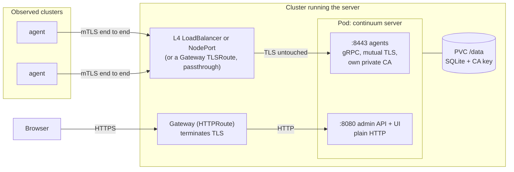

# Deploying the Continuum server on Kubernetes

This guide covers the **server** (control plane and web UI) and its databases. The chart is [`deploy/helm/continuum-server`](helm/continuum-server) (its [README](helm/continuum-server/README.md) documents every value and which server flags each one needs). Agents run in the clusters you observe and are installed with the command the server prints; see [Connect the first cluster](#connect-the-first-cluster).

> **Status of this guide.** The chart was checked with `helm lint`, `helm template` over many value combinations, and `kubectl apply --dry-run=server` against a single-node k3s API. The server binary was built and started locally with the exact arguments the chart renders. **No pod has run in a cluster, no container image has been built, and the backup CronJob has not run against a real CSI driver.** Treat the first install as a trial run.

> **New here? Start with the docs site instead.** Its [Quickstart](../docs-site/docs/getting-started/quickstart.md), [Installation](../docs-site/docs/installation/index.md) and [Troubleshooting](../docs-site/docs/troubleshooting/common-errors.md) pages cover the same ground this file does, in a more approachable order, using this repo's own zero-config published images. This file remains the deep operational reference — backup and restore, signing verification, air-gapped installs, the full values reference and security notes — for once you're past a first install.

## Contents

1. [Prerequisites](#prerequisites)
   - [Using this repo's own published images (zero-config)](#using-this-repos-own-published-images-zero-config)
2. [Quick start](#quick-start)
3. [The two ports](#the-two-ports)
4. [DNS and certificates](#dns-and-certificates)
5. [First sign-in](#first-sign-in)
6. [Connect the first cluster](#connect-the-first-cluster)
7. [Upgrades](#upgrades)
8. [Backup and restore](#backup-and-restore)
9. [Scaling limits](#scaling-limits)
10. [Neo4j](#neo4j)
11. [Signing and verifying releases](#signing-and-verifying-releases)
12. [Dependency scanning](#dependency-scanning)
13. [Air-gapped installs](#air-gapped-installs)
14. [Values reference](#values-reference)
15. [Troubleshooting](#troubleshooting)
16. [Security notes](#security-notes)

## Prerequisites

* Kubernetes 1.25 or newer and Helm 3.
* A default **StorageClass** that provisions volumes (the server needs one PersistentVolumeClaim; bundled Neo4j needs another).
* A way to expose two ports (see [The two ports](#the-two-ports)): a LoadBalancer or NodePort for agents, and a Gateway (HTTPRoute) for the UI. On k3s and kind a NodePort and `kubectl port-forward` are enough.
* A DNS name for agents to dial, and a certificate for the UI (cert-manager works well). A public IP address also works for agents.
* The server **image**. If you forked or pushed this repository to GitHub, [`.github/workflows/release.yml`](../.github/workflows/release.yml) already publishes one on every push to `main` and every version tag - see [Using this repo's own published images](#using-this-repos-own-published-images-zero-config) below, and skip straight to [Quick start](#quick-start) once its one-time setup is done. Otherwise, build it yourself from the repository root and push it to a registry your cluster can pull from:

  ```console
  docker buildx build -f backend/Dockerfile --target server -t REGISTRY/server:0.1.0-dev --push .
  ```

  Then `--set image.repository=REGISTRY/server`, and `--set image.tag=...` (the default is the chart's `appVersion`, `0.1.0-dev`). Pin by digest in production: `--set image.digest=sha256:...`.

### Using this repo's own published images (zero-config)

Every push to `main` and every `vX.Y.Z` tag runs [`.github/workflows/release.yml`](../.github/workflows/release.yml): it builds and pushes the `continuum` image (agent, node probe and flow collector - one binary, three roles) and the `server` image, packages both Helm charts, and pushes everything to **this repository's own GitHub Container Registry namespace**, `ghcr.io/<owner>` (lower-cased automatically; `<owner>` is the GitHub user or organisation the repo lives under). Everything it pushes is signed with cosign, keylessly, off the workflow's own OIDC token - nothing to generate or store as a secret (see [Signing and verifying releases](#signing-and-verifying-releases)).

The part that actually makes this zero-config: packaging bakes that same `ghcr.io/<owner>` namespace into the chart's own default values (`image.repository` in both charts, and the server chart's `agentInstall.imageRegistry`) before pushing the `.tgz`, rather than leaving the source tree's placeholder names (`continuum/continuum`, `continuum/server`) in the published chart. That means:

* Installing the **server** straight from the published chart needs no `--set image.repository=...` at all:

  ```console
  helm install continuum-server oci://ghcr.io/<owner>/continuum-server --version <chart version> \
    --set agent.publicAddress=... [the rest of your usual values]
  ```

* The **"Connect a cluster"** screen's printed `helm install` command for the *agent* already points at the same registry, because the server chart's `agentInstall.imageRegistry` (what that command uses) came pre-set to `ghcr.io/<owner>` in the same step - nobody installing the server from this chart has to visit **Settings → Installation** or pass `--image-registry` at all.

**One manual, one-time step this workflow cannot do for you**: GHCR creates a newly-pushed package as **private**, even from a public repository's own Actions run. After the workflow's first run, the repo's right sidebar on GitHub shows a **Packages** section; open each of the four (`continuum`, `server`, `continuum-agent`, `continuum-server`), **Package settings** at the bottom, **Change visibility → Public** (and confirm "Link to this repository" is checked so they show up on the repo's page). Every later push publishes new versions into the same, already-public packages - this is a once-per-repository step, not a once-per-release one.

`main` publishes a floating `edge` tag (and a `sha-<short>` one); a `vX.Y.Z` tag publishes that exact version and moves `latest` to it. Pin to a real version or a digest for anything other than a trial, the same as with any other registry.

`scripts/publish.sh` (below) still has its place: publishing to a registry other than this repo's own GHCR namespace, publishing from a fork without waiting on its Actions run, or a one-off local build to test before it reaches CI.
* Optional: the CSI snapshot CRDs and a `VolumeSnapshotClass` if you want scheduled snapshots; the Gateway API CRDs if you use `httproute` or `agent.tlsRoute`.

## Quick start

### k3s or kind: NodePort, three commands

Agents reach a node address on a NodePort (the first line only looks that address up); you reach the UI through a port-forward. Nothing here tells the chart a TLS proxy is in front, so it generates a self-signed certificate for the admin port itself (`admin.tls.selfSigned`, on by default) rather than refusing to install. (For a kind cluster, map the NodePort out with `extraPortMappings` if agents live outside the docker network. For k3s, import the image with `k3s ctr images import` if the node cannot pull it.)

```console
NODE_IP=$(kubectl get nodes -o jsonpath='{.items[0].status.addresses[?(@.type=="InternalIP")].address}')

helm install continuum-server deploy/helm/continuum-server -n continuum --create-namespace \
  --set image.repository=REGISTRY/server \
  --set agent.publicAddress=$NODE_IP:30443 --set agent.service.type=NodePort --set agent.service.nodePort=30443

kubectl -n continuum logs deployment/continuum-server | grep -A2 'First start'   # the one-time admin password

kubectl -n continuum port-forward service/continuum-server 8080:8080              # then open https://localhost:8080
```

`https://localhost:8080` shows a "not private" warning the first time — the certificate is self-signed, generated automatically, not signed by anything your browser trusts. Click through it; this is fine for a trial, but do not expose this address further. Prefer plain HTTP over the tunnel instead (no warning, since `kubectl port-forward` already runs over an encrypted connection to the API server)? Add `--set admin.behindTlsProxy=true` and use `http://localhost:8080`. (With the release named `continuum-server` the objects are called `continuum-server`; any other release name gives `<release>-continuum-server`.)

### A cloud cluster: LoadBalancer for agents, Gateway API and cert-manager for the UI

Assumes a `Gateway` named `shared-gateway` already exists in a `gateways` namespace, with an HTTPS listener whose certificate cert-manager already manages (Gateway API support in cert-manager provisions this on the `Gateway` itself, not per-route) — this chart only creates the `HTTPRoute` that attaches to it.

`values-prod.yaml`:

```yaml
image:
  repository: registry.example.com/continuum/server
  digest: sha256:...            # immutable
registration: invite

agent:
  publicAddress: agents.continuum.example.com:8443     # what agents dial; a DNS name that points at the agent LoadBalancer
  service:
    type: LoadBalancer
    externalTrafficPolicy: Local                       # keep the agent's source address for geoip
    annotations:
      service.beta.kubernetes.io/aws-load-balancer-type: nlb    # an L4 load balancer, never an HTTP one

httproute:
  enabled: true                                      # also switches on --admin-behind-tls-proxy
  parentRefs:
    - name: shared-gateway
      namespace: gateways
      sectionName: https
  hostnames: [continuum.example.com]

persistence: {size: 10Gi}
neo4j: {mode: bundled}
backup:
  volumeSnapshot: {enabled: true, className: csi-snapclass}
networkPolicy: {enabled: true}
```

```console
helm install continuum-server deploy/helm/continuum-server -n continuum --create-namespace -f values-prod.yaml
kubectl -n continuum get service continuum-server-agent -w     # wait for EXTERNAL-IP, then create the DNS record
```

Read `NOTES.txt` in the output: it prints what agents will dial, how to see the UI address, and the exact `kubectl logs` for the first password.

## The two ports

The server has two listeners with opposite needs.



* **Agent port (8443).** Agents dial out to it with gRPC over *mutual* TLS. The server signs each agent's certificate with its own private CA and the agents pin that CA, so the TLS session must run from the agent all the way into the pod. An L7 proxy that terminates TLS (a normal Ingress, a CDN, an HTTP load balancer) breaks the handshake for every agent. Expose it with a `LoadBalancer` or `NodePort` Service (L4), or with TLS **passthrough** via a Gateway API `TLSRoute` behind a `protocol: TLS` / `mode: Passthrough` listener (`agent.tlsRoute`). With passthrough the Gateway routes on the SNI host, so agents dial that hostname on the Gateway's port (usually 443): `agent.publicAddress=continuum.example.com:443`.
* **Admin port (8080).** The JSON API and the web UI. Inside the pod it is plain HTTP, and the server **refuses to start** on a non-loopback address in clear text unless it is told a TLS proxy protects it (`--admin-behind-tls-proxy`) or it serves TLS itself (`--admin-tls-cert/-key`). The chart sets the first automatically when `httproute` is enabled; use `admin.tls.secretName` for the second. If none of that applies, the chart generates and manages a self-signed certificate for the pod to serve instead (`admin.tls.selfSigned`, on by default) rather than stopping - real HTTPS with zero external dependencies, at the cost of a one-time browser warning. `admin.tls.selfSigned=false` restores the old behavior of stopping with a message until you pick one of the other options explicitly.

## DNS and certificates

Three different certificates are involved.

1. **The UI certificate**, for browsers, issued for your UI host (cert-manager + Let's Encrypt in the example above). With Gateway API this lives on the `Gateway`'s own HTTPS listener, not on anything this chart creates — the `HTTPRoute` it templates just attaches to that listener. It is unrelated to the agents.
2. **The agent-port server certificate**, issued by the server itself from its private CA. Its names come from the host in `agent.publicAddress` plus `agent.extraHosts`; a wrong or missing name shows up as a TLS handshake failure on the agent. This is why `agent.publicAddress` is required and must be exactly what agents use (a name or an IP; no scheme, no path). It is re-issued when the names change, and agents keep working because they trust the CA, not the certificate.
3. **Optional admin TLS** (`admin.tls.secretName`): the pod serves HTTPS itself. The Gateway in front then must speak HTTPS to the pod, which needs a `BackendTLSPolicy` in Gateway API. When you don't provide one, the chart generates its own self-signed certificate for this instead (`admin.tls.selfSigned`) - untrusted by any browser (a click-through warning), but real TLS with nothing to configure, for a trial or a LAN-reachable install.

DNS: one name for the UI (to the Gateway's address) and one for agents (to the agent LoadBalancer, or the same host under passthrough). Point the agent name at a stable address. **Changing `agent.publicAddress` later changes the address every agent was installed with**: keep the old name resolving (and list it in `agent.extraHosts` while both are in use) and upgrade the agents' `server.address` at your pace.

## First sign-in

On a fresh database the server creates the user `admin` with a random one-time password and prints it **once**, to stderr:

```console
kubectl -n continuum logs deployment/continuum-server | grep -A2 'First start'
```

Sign in with `admin` and that password; the server makes you choose a new one immediately. The chart never generates or stores an admin password.

Alternative: create a Secret and set `admin.existingPasswordSecret` (key `password` by default). It becomes the first administrator's password (`CONTINUUM_ADMIN_PASSWORD`), subject to the password policy, on a fresh database only. It is not forced to change, so treat the Secret as the credential. If the database already has users the Secret is ignored.

If you lost the password: `kubectl -n continuum exec deployment/continuum-server -- /server reset-password --data-dir=/data admin` prints a new one-time password (the image has no shell, but `exec` of the binary works). `server create-org --owner USER NAME` and `server verify-audit` are the other maintenance commands. These are run in the pod; not verified in a cluster.

`registration` defaults to `invite`: people join through an invitation created by an organization administrator. `closed` disables self-registration entirely (accounts are provisioned with the commands above). `open` lets anyone who can reach the admin address create an account and an organization; use it only on a private network.

## Connect the first cluster

1. In the UI open **Connect a cluster**. It prints a complete `helm install` for the agent, with `server.address` (your `agent.publicAddress`), `server.caPin` (the fingerprint of this server's CA) and a one-hour enrollment token.
2. Run it against the cluster you want to observe.
3. The agent appears on the **Discovery** page as pending. Compare the cluster fingerprint it shows with `kubectl get namespace kube-system -o jsonpath='{.metadata.uid}'` on that cluster, and approve only if they match.

`agentInstall.imageRegistry`, `agentInstall.imageTag` and `agentInstall.chartRef` change what that command points at (empty means the server's own defaults; `chartRef: local` makes the server hand out the chart it carries, which `curl` fetches from `https://UI-HOST/charts/<file>` without credentials, useful when there is no OCI registry).

The CA pin can also be read without the UI:

```console
kubectl -n continuum logs deployment/continuum-server | grep -o 'ca_pin=[^ ]*'
```

or, after signing in and choosing your own password, from the API (the org id is the chart's `org`, `default` unless changed):

```console
UI=https://continuum.example.com
curl -sc jar -H 'X-Requested-With: curl' -H 'Content-Type: application/json' \
     -d '{"username":"admin","password":"..."}' $UI/api/v1/auth/login
curl -sb jar $UI/api/v1/orgs/default/info | jq -r .caPin
```

### The agent's namespace and RBAC

The printed command installs into `continuum-system` by default, but nothing in the chart requires that name: every template is namespaced with `{{ .Release.Namespace }}`, so `helm install continuum-agent ... -n observability --create-namespace` works exactly the same. Pick whatever namespace matches how you organise observability tooling in that cluster; the server tracks the namespace each agent actually reports (from the pod's own downward-API namespace, sent with its first Hello) and uses it when it later prints `helm upgrade`/`helm uninstall` commands for that agent, so this is safe to change per install without breaking anything shown in the UI later.

**Whoever runs `helm install`/`helm upgrade` for the agent needs cluster-scoped RBAC-write permission**, not just a namespace role: each access tier adds a `ClusterRole` + `ClusterRoleBinding` (read-only: nodes, namespaces, workloads, pods, services, ingresses — never Secrets or ConfigMaps), because tier 1+ reads across the whole cluster, not one namespace. If the person or pipeline installing the chart cannot create `ClusterRole`/`ClusterRoleBinding` objects, the install fails at that resource with a normal Kubernetes forbidden error — grant `cluster-admin` for that one apply, or a narrower role scoped to just those two resource kinds, rather than to the installer generally. A few environments cannot do this at all:

* **Multi-tenant platforms and vclusters** that intentionally disallow `ClusterRole` for tenants. Set `rbac.mode=namespaced` and list the namespaces to watch in `scope.namespaces`: tier 2 is then granted with a `Role`/`RoleBinding` per namespace instead of one cluster-wide `ClusterRole` (tier 1 — nodes, storage classes, ingress classes — is unaffected: those are cluster-scoped types with no namespaced form, so they still need the tier-1 `ClusterRole` regardless). It is a real trade-off, not a strict downgrade: `scope.selector` cannot be used in this mode (evaluating a label selector needs to list namespaces cluster-wide, exactly what this mode avoids), a namespace added to the cluster later needs a `helm upgrade` with it added to `scope.namespaces` before the agent reports on it, and namespace metadata (labels, creation time) and persistent volumes are never read at all — no `Role`, in any namespace, can grant either (both are cluster-scoped types), so only claims are shown, not volumes.

  ```console
  helm install continuum-agent deploy/... -n shop \
    --set access.tier=2 --set rbac.mode=namespaced --set 'scope.namespaces={shop,payments}' ...
  ```
* **OpenShift.** The chart's `ClusterRole`s apply cleanly, but the flow collector's DaemonSet pod runs as root with `CAP_BPF`/`CAP_PERFMON` for eBPF, which needs a custom `SecurityContextConstraints` beyond the defaults (`restricted`/`privileged`) — this is not currently generated by the chart. Either disable the flow collector (`flow.enabled: false`) on OpenShift for now, or create a matching SCC and bind it to the agent's ServiceAccount before installing tier 2.
* **GitOps-managed clusters**, where `helm install` isn't how changes normally land. `helm template deploy/helm/... -n observability --set access.tier=2 | kubectl diff -f -` (or your GitOps tool's own render step) produces the same manifests for review and commit; nothing about the chart assumes a live `helm install` specifically.

**Narrowing an approved tier in the UI does not shrink what is granted in the cluster.** Lowering the tier here (or the server pushing a narrower tier) is agent-side: the agent stops reading and reporting at the wider tier immediately, but the `ClusterRoleBinding` for the higher tier is untouched — it is a reporting/privacy control, not an RBAC control. When this leaves an agent under its installed ceiling, its detail page shows the exact `helm upgrade ... --set access.tier=N` that actually removes the wider `ClusterRole`/`ClusterRoleBinding` from the cluster; running it is a separate, deliberate step for whoever owns that cluster. The same gap exists on revoke or reject: the connection ends, but the ServiceAccount, RBAC and pods stay installed until removed, so a revoked or rejected agent's detail page also shows the `helm uninstall` and identity-`Secret`-deletion commands for that cluster (the Secret is kept by `helm uninstall` on purpose, so an accidental uninstall cannot orphan re-enrollment — delete it explicitly if you want a clean slate before reinstalling). Widening, by contrast, is a real Kubernetes change every time (`helm upgrade --set access.tier=N` higher creates the new `ClusterRole`/`ClusterRoleBinding`), so there's no equivalent asymmetry in that direction.

Narrowing `scope.namespaces`/`scope.exclude`/`scope.selector` is a third, separate lever: it is agent-side filtering of what gets reported, same as the tier narrowing above, and it never narrows the `ClusterRole` either — the agent still holds cluster-wide read access and simply drops what falls outside scope before sending it.

## Upgrades

```console
helm upgrade continuum-server deploy/helm/continuum-server -n continuum -f values-prod.yaml --set image.tag=NEW
```

* Use your values file rather than `--reuse-values`, so new chart values pick up their defaults deliberately.
* The Deployment uses `Recreate` (a ReadWriteOnce volume cannot be mounted twice): expect a gap of seconds to a minute in which the UI is down and agents are reconnecting. They reconnect on their own and no agent re-enrolls.
* **Data migration.** The server upgrades its SQLite schema in place when it starts (a version marker in the database), and Neo4j upgrades its store when a newer image opens it. Neither is designed to go backwards: **take a backup before every upgrade** (a VolumeSnapshot, or a [cold backup](#backup-and-restore)) and roll back by restoring it, not by re-deploying an older image over a migrated database.
* The PVC is never touched by an upgrade (`persistence.keepOnUninstall` marks it `helm.sh/resource-policy: keep`, which Helm also honours if you later switch to `persistence.existingClaim`). A larger `persistence.size` expands the volume only if the StorageClass has `allowVolumeExpansion`.
* Chart upgrades never change the Deployment's selector labels, so `helm upgrade` is safe across chart versions.
* The bundled Neo4j image tag is pinned (`5.26.30-community`). Move to a newer 5.26 patch freely after a snapshot; a major or minor jump is your decision.

## Backup and restore

`/data` holds:

| Path | What |
|---|---|
| `continuum.db` (+ `continuum.db-wal`, `continuum.db-shm`) | SQLite: accounts, sessions, tokens, workspace, and everything not in Neo4j |
| `pki/` | the enrollment CA **and its private key**: the trust root of every agent |

The server also has its own `server backup` and `server restore` commands: a consistent copy of the database and the CA taken **while it runs**, checked on restore, on any kind of install. They, what is and is not worth backing up, and how the database and workspace format versions behave on upgrade and rollback are in **[BACKUP.md](BACKUP.md)**.

**If the CA key is lost, every enrolled agent is orphaned.** A new CA has a new fingerprint, so agents (which pin the old one) can no longer connect: each cluster has to be enrolled again with a new pin and token, and appears as a new, unapproved agent. Treat the backup like a private key: encrypt it and store it off the cluster.

### Encrypting the CA key at rest

`pki.encryptAtRest` (default `true`) means the key on disk is never plaintext: this chart generates a passphrase itself, once, into its own Secret (kept across upgrades and even a `helm uninstall`, the same way the PVC is), and the server encrypts the key under it (argon2id + AES-256-GCM) the moment it starts. You do not need to set anything for this; it is the default, not an opt-in.

That Secret is deliberately kept apart from both the PVC (the encrypted key material) and the database: back it up separately, the same way you would a private key, because **the passphrase is as sensitive as the key it protects, and losing it is exactly as bad as losing the key** — a backup of the encrypted key without it is useless. `kubectl get secret <release>-continuum-server-ca-passphrase -o jsonpath='{.data.passphrase}' | base64 -d` reads it out to store somewhere independent (a password manager, a separate secret store), which is worth doing once right after the first install rather than discovering it's needed during a disaster recovery.

Bringing your own passphrase (from an external secret manager, say, via External Secrets Operator or similar) instead of the chart's own: set `pki.caKeyPassphraseSecret.name` (and `.key` if not `passphrase`) to an existing Secret; it always takes priority over the auto-generated one, and the auto-generated Secret is then simply not created.

Turning it off (`pki.encryptAtRest=false`) goes back to the key sitting in plaintext on the PVC, mode 0600, with only a log warning at startup. Reasonable for local development against a throwaway cluster; not for anything where the PVC, its snapshots, or its backups might ever leave a trust boundary you control end to end. Under `helm template` for a GitOps flow (Argo CD, Flux), the auto-generated passphrase cannot be looked up from the live cluster (`lookup` returns nothing there), so it would render a new random value on every run — in that flow, create the Secret yourself and set `pki.caKeyPassphraseSecret.name`, exactly as with `neo4j.auth.existingSecret`.

See `internal/pki/ROTATION.md` in the server source for the full backup/restore/rotation mechanics.

**Why not just copy the file.** The database runs in WAL mode: recent commits live in `continuum.db-wal`. Copying `continuum.db` while the server runs gives a backup that silently misses them, and a second pod cannot mount the ReadWriteOnce volume unless it lands on the same node. The two safe options are below.

### 1. Scheduled snapshots (the chart's option)

`backup.volumeSnapshot.enabled=true` creates a CronJob that takes a CSI `VolumeSnapshot` of the data volume on `schedule` (default daily at 03:17), waits until it is `readyToUse`, and keeps the newest `retain` (7). With `includeNeo4j` it does the same for the bundled Neo4j volume. A snapshot captures the whole volume at one instant, so the database, its WAL and the CA key are consistent with each other; it is *crash-consistent*, which SQLite in WAL mode recovers from like a power cut (the last moments before the snapshot can be missing, the database is not corrupted).

```console
kubectl -n continuum get volumesnapshot -l app.kubernetes.io/component=backup
```

Limits: it needs snapshot CRDs, a driver with snapshot support and a `VolumeSnapshotClass`; a snapshot usually lives on the same storage system as the volume, so it does not protect you from losing that system. Copy snapshots out with your storage tooling, or add the cold backup. This CronJob is not tested against a real driver; a failing snapshot makes the Job fail (visible in `kubectl get jobs`), it does not pass silently.

Restore from a snapshot: create a PVC from it, and point the release at it.

```yaml
apiVersion: v1
kind: PersistentVolumeClaim
metadata: {name: continuum-data-restored, namespace: continuum}
spec:
  accessModes: [ReadWriteOnce]
  resources: {requests: {storage: 10Gi}}
  dataSource: {apiGroup: snapshot.storage.k8s.io, kind: VolumeSnapshot, name: SNAPSHOT_NAME}
```

```console
helm upgrade continuum-server deploy/helm/continuum-server -n continuum -f values-prod.yaml --set persistence.existingClaim=continuum-data-restored
```

### 2. Cold backup (works everywhere, needs a brief stop)

Stopping the server checkpoints the WAL (a clean shutdown closes the database), so the files are consistent. It is also the only way to get the CA key out without snapshots.

```console
kubectl -n continuum scale deployment/continuum-server --replicas=0
kubectl -n continuum apply -f - <<'EOF'
apiVersion: v1
kind: Pod
metadata: {name: continuum-backup}
spec:
  restartPolicy: Never
  securityContext: {runAsNonRoot: true, runAsUser: 65532, runAsGroup: 65532, fsGroup: 65532, seccompProfile: {type: RuntimeDefault}}
  containers:
    - name: tar
      image: busybox:1.37
      command: [sleep, "3600"]
      securityContext: {allowPrivilegeEscalation: false, capabilities: {drop: [ALL]}}
      volumeMounts: [{name: data, mountPath: /data, readOnly: true}]
  volumes: [{name: data, persistentVolumeClaim: {claimName: continuum-server-data}}]
EOF
kubectl -n continuum wait --for=condition=Ready pod/continuum-backup
kubectl -n continuum exec continuum-backup -- tar czf - -C /data . > continuum-data-$(date +%F).tgz
kubectl -n continuum delete pod continuum-backup
kubectl -n continuum scale deployment/continuum-server --replicas=1
```

(Replace `continuum-server-data` with your PVC name. `helm upgrade` also resets replicas to 1.) Encrypt the archive (`age`, `gpg`) before it leaves your workstation: it contains the CA private key (encrypted under the passphrase, by default — see "Encrypting the CA key at rest" above — but treat the archive as sensitive regardless).

With `pki.encryptAtRest` (the default), also export the passphrase Secret alongside this archive — the key in the archive is useless without it, so a backup missing the passphrase is not really a backup:

```console
kubectl -n continuum get secret continuum-server-ca-passphrase -o yaml > continuum-ca-passphrase-$(date +%F).yaml
```

(Replace the Secret name if you set `pki.caKeyPassphraseSecret.name`, or if the release name differs from `continuum-server`.) Keep this file wherever you keep the archive's decryption key: together they reconstruct the CA, separately neither does much.

Restore: scale to 0, run the same pod with the volume writable (drop `readOnly`) and `kubectl exec -i ... -- sh -c 'cd /data && tar xzf -' < archive.tgz`, make sure the files end up owned by 65532 (`fsGroup` and the pod's user do that), delete the pod, scale back to 1. If the passphrase Secret currently in the cluster is not the one this archive's key was encrypted under (a rare case: the Secret was deleted and regenerated since this backup was taken), restore it too with `kubectl apply -f continuum-ca-passphrase-....yaml` before scaling back up, or the server will refuse to start with `ErrWrongPassphrase`. The server logs `continuum server started` with the same `ca_pin` as before; if it differs, agents will not connect.

### Neo4j

The snapshot option covers the bundled volume as crash-consistent (Neo4j replays its transaction log). For a fully consistent copy stop Neo4j and run `neo4j-admin database dump` into a scratch pod. History in Neo4j is not the trust root: losing it loses history, not agents.

## Scaling limits

The server is **not horizontally scalable today** and the chart offers no `replicas` value. Reasons, all in the current design: the state is one SQLite database with a single writer in `/data`; the enrollment CA and its key live in the same directory and cannot be shared safely by two writers; agent sessions and the live topology are held in memory by the one process that owns the agent connections; and a ReadWriteOnce volume can be mounted by one node at a time. Two replicas would fork the state, not add capacity. Scale up instead (`resources`), and plan for the seconds-long gap during pod restarts. Neo4j Community is also a single instance.

A `PodDisruptionBudget` is off by default because with one replica `minAvailable: 1` only blocks node drains, and `maxUnavailable: 1` protects nothing. Enable it if you want drains to stop and ask you.

## Neo4j

Neo4j holds topology history, events, the audit trail and workspace revisions. This chart makes it mandatory: `neo4j.mode` is always `bundled` or `external`, never `none` (a plain server binary run outside this chart can still start with no Neo4j at all and degrades gracefully; the chart just no longer offers that as a deployment choice).

| Mode | Use when | Notes |
|---|---|---|
| `bundled` (default) | you want history and have no Neo4j | StatefulSet with the official `neo4j` Community image, its own PVC, a generated or supplied password Secret, a headless Service, probes on HTTP 7474, resource requests and limits, optional NetworkPolicy |
| `external` | you already run Neo4j (Aura, an operator, your own) | `neo4j.external.url` and `neo4j.external.existingSecret`; https, or an in-cluster/loopback http address |

**Licence and shape.** Neo4j Community edition is GPLv3 and single-instance (no clustering, no online backup). The chart runs it as a separate process; the Continuum server only talks to it over HTTP. Use `external` with your own licensed or managed Neo4j if you need HA or Enterprise features, or want to keep the GPL software out of your deployment.

**Passwords.** The server reads the password from a file (`--neo4j-password-file`), never from a command-line argument. Bundled: the chart generates a 32-character secret on first install and reuses it on every upgrade (`lookup`); it stays if you uninstall, so a reinstall over the same volume still matches. Supply your own with `neo4j.auth.existingSecret`. In GitOps flows that render with `helm template` (no `lookup`) always supply your own Secret.

**Plain HTTP.** The bundled instance speaks HTTP inside the cluster. Today's server only logs a warning for plain http to a non-loopback host; a coming build refuses it unless `--neo4j-allow-insecure-http`, which is what `neo4j.allowInsecureHttp=true` passes. Turn `neo4j.networkPolicy.enabled` on so only the server pod can reach it.

**Sizing.** Neo4j does not size itself to its container; the chart sets heap and page cache explicitly. Keep the container limit about 500 MiB above `heapMax + pagecache` for the JVM's own use.

| Install | Heap / pagecache | Pod memory request / limit | Disk |
|---|---|---|---|
| Small (default): a handful of clusters, months of history | `512m` / `256m` | `1Gi` / `1536Mi` | `10Gi` |
| Medium: tens of clusters, a year of history | `1g` / `1g` | `2Gi` / `2560Mi` | `20-50Gi` |
| Large: hundreds of clusters | `2g` / `2g+` | `4Gi` / `5Gi` | size for retention; consider `external` |

These are starting points, not measurements; watch memory and the `/api/v1/orgs/<org>/storage` view in the UI and adjust.

## Signing and verifying releases

`scripts/publish.sh` (builds and pushes the `continuum` agent/probe/flow image, the `server` image, and both Helm
charts) signs everything it pushes with [cosign](https://docs.sigstore.dev/), automatically when cosign is on your
`PATH`. It signs keylessly by default: cosign gets a short-lived certificate from Sigstore's public Fulcio CA off
an OIDC login (your GitHub/Google/Microsoft account interactively, or the CI provider's own OIDC token in GitHub
Actions, GitLab CI, etc. - nothing to generate, rotate or leak as a long-lived private key) and records the
signature in Sigstore's public Rekor transparency log. `SIGN=0` turns signing off, `SIGN=1` requires it (fails the
publish if cosign is missing, rather than silently shipping unsigned - the setting worth using in CI). For a
registry with no route to Fulcio/Rekor (a genuinely air-gapped one), `COSIGN_KEY=cosign.key` signs with a key pair
instead; see cosign's own docs for generating one (`cosign generate-key-pair`) and for `--tlog-upload=false` to
skip the public transparency log entirely.

**Verify an image before you trust it**, the same way whether you pulled it from a registry, a CI artifact, or
picked a tag out of `helm show values`:

```console
cosign verify --certificate-identity-regexp '.*' --certificate-oidc-issuer-regexp '.*' myname/continuum:0.2.0
```

This only proves *some* Sigstore identity signed it, which is enough to see what to pin: read the `Issuer` and
`Subject` cosign prints from the certificate, then re-run with the exact values pinned (`--certificate-identity`
and `--certificate-oidc-issuer` in place of the two `-regexp` flags above) - that second, narrower command is the
one that actually proves it, and the one worth scripting into a deploy pipeline or the admission policy below.
Digest pins (`image.digest=sha256:...`, which `publish.sh` prints after every push) verify the same way: replace
the tag with `@sha256:...`, which also removes any doubt about which build a floating tag currently points at.

**Enforce it in the cluster**, so an unsigned or wrongly-signed image is refused at admission rather than caught by
someone reading logs afterwards: [`deploy/policy/kyverno-verify-images.yaml`](policy/kyverno-verify-images.yaml) is
a [Kyverno](https://kyverno.io/) `ClusterPolicy` using its built-in cosign verification, with the two identity
placeholders explained in the file and a note on testing it in Kyverno's Audit mode before switching it to Enforce.
It needs Kyverno installed (a `helm install` of its own, linked from the policy file) but not a separate Sigstore
policy-controller. Point it at your own registry namespace once you have one, rather than leaving the
repository-name wildcard match in place indefinitely.

None of this replaces the RBAC and image-pull-secret controls already in the charts (see "The agent's namespace
and RBAC" above) - it answers a different question, "is this actually the image I built", not "what can it do
once it's running".

## Dependency scanning

Both halves of the codebase are scanned for known vulnerabilities, and this section is where a finding gets fixed
or, when it can't be fixed yet, written down instead of silently dropped.

**Backend (Go): [`govulncheck`](https://go.dev/blog/vuln)**, not `go list -m all` against an advisory feed - it
does call-graph analysis, so it reports only vulnerabilities in code this module's binaries can actually reach,
not every CVE that happens to exist somewhere in a required module.

```console
cd backend
go install golang.org/x/vuln/cmd/govulncheck@latest
govulncheck ./...
```

As of this writing, a scan of this module found two kinds of reachable vulnerability, handled differently:

- **One `google.golang.org/grpc` finding (GO-2026-6443, a server panic on a request missing `:authority`/`Host`)**
  has *no fix in a tagged stable release yet* - only in a `v1.85.0-dev` pre-release. Shipping a `-dev` grpc-go
  build in production would trade a known, narrow DoS for an unknown one, so `backend/go.mod` stays on the latest
  stable `v1.84.0` until grpc-go actually cuts `v1.85.0`. Re-run `go list -m -versions google.golang.org/grpc` (or
  just `govulncheck` again) periodically and `go get google.golang.org/grpc@latest` once a stable fixed version
  exists - this is the one open item from this pass.
- **Everything else reachable (36 findings in total) was in the Go standard library itself** - `crypto/tls`,
  `crypto/x509`, `net/http`, `net/url`, `html/template`, `encoding/asn1`, `encoding/pem`, `archive/tar`, `mime`,
  `net/textproto` - ranging from quadratic-complexity DoS and memory-exhaustion bugs to a couple of XSS-in-
  `html/template` findings (reachable through the agent's own `/healthz` page, see `internal/agent/health.go`).
  None of these are `go.mod` dependencies to bump; they're fixed by the Go toolchain patch version used to
  *build* the binary. `backend/go.mod` now pins `toolchain go1.25.13` (the line has a comment explaining why and
  when to bump it again) - with `GOTOOLCHAIN=auto` (the default; nothing in `backend/Dockerfile` overrides it),
  `go build`/`go test`/`go install` all download and use go1.25.13 automatically even on a machine whose own `go`
  binary is older, so this one line is what actually closes all 36 CVEs for anyone building this module, not just
  a statement of intent. `backend/Dockerfile`'s `golang:1.25` build-stage tag already floats to the latest 1.25.x
  patch on each build; the `toolchain` pin is the belt-and-suspenders version that works even against a stale
  cached image.
- The three module-level CVEs govulncheck reported *before* this pass (`google.golang.org/grpc`, `github.com/
  cilium/ebpf`, and transitively `golang.org/x/net`/`golang.org/x/text`) are fixed by the dependency versions
  already in `go.mod` (`grpc` v1.84.0, `cilium/ebpf` v0.22.0) - confirmed by the same `govulncheck` re-run, and by
  a full `go test ./...` pass (zero regressions) both before and after the bump.

**Frontend (JS/TS): `npm audit`** at the repo root (`/home/claude/k8s-topology`, not `backend/`):

```console
npm audit
```

This currently reports **zero vulnerabilities** across all 175 direct and transitive dependencies (prod, dev and
optional). Nothing to fix here as of this writing; re-run it after any `npm install`/`npm update` that changes
`package-lock.json`, since a clean result today says nothing about a dependency added tomorrow.

**Both run in CI** on every push and pull request ([`.github/workflows/ci.yml`](../.github/workflows/ci.yml)), because a
dependency scan that only runs when someone remembers to run it by hand will eventually get skipped. `npm audit
--audit-level=high` blocks the build; `govulncheck` is deliberately non-blocking (`continue-on-error: true`) for
now, only because of the one accepted, currently-unfixable grpc-go finding above - govulncheck exits non-zero for
any finding, fixable or not, and a hard failure over something nobody can fix yet would just teach everyone to
ignore the check. Read its log on every run regardless; once that grpc-go finding has a real fix, bump the
dependency and drop `continue-on-error` so a genuinely new, fixable finding blocks the build the way it should.

## Air-gapped installs

1. **Images to mirror** into your registry: the server image (you build it: `--target server`), `neo4j:5.26.30-community` if bundled, `alpine/k8s:1.34.11` (or your own image with `sh` and `kubectl`) if `backup.volumeSnapshot` is on, and the one `continuum` agent image (the agent, probe and flow roles are the same image) for the clusters you will connect. Set `image.repository`, `neo4j.image.repository`, `backup.volumeSnapshot.image.repository` and `imagePullSecrets`. Digest pins work: `image.digest`, `neo4j.image.digest`.
2. **The chart**: on a connected machine `helm pull` it from wherever you publish it (or `helm package deploy/helm/continuum-server`) and carry the `.tgz` in; `helm install ./continuum-server-0.1.0.tgz ...`.
3. **The agent chart and images**: set `agentInstall.imageRegistry` to your mirror (the printed install command then points every image there) and `agentInstall.chartRef` to either an OCI location in your registry or `local`, so the server hands out its embedded agent chart itself (no registry needed for the chart). `agentInstall.imageTag` pins the agent version.
4. **GeoIP** (optional): supply the `.mmdb` yourself (`geoip.path` and a volume); nothing is downloaded. The UI loads no third-party assets (its Content-Security-Policy is `'self'` only), so it works offline.
5. cert-manager with an internal issuer, or your own TLS Secret, replaces Let's Encrypt.

## Values reference

The important values; all of them are documented in `values.yaml` and tabulated in the [chart README](helm/continuum-server/README.md).

| Value | Default | What it does |
|---|---|---|
| `agent.publicAddress` | *required* | `host:port` agents dial; becomes a certificate name |
| `agent.extraHosts` | `[]` | more certificate names |
| `agent.service.type` | `LoadBalancer` | `LoadBalancer`, `NodePort`, `ClusterIP` |
| `agent.tlsRoute.enabled` | `false` | Gateway API TLSRoute (passthrough) |
| `httproute.*` | off | UI exposure, TLS terminated at the Gateway |
| `admin.behindTlsProxy` | auto | passes `--admin-behind-tls-proxy`; auto = true with `httproute` |
| `admin.tls.secretName` | `""` | the pod serves HTTPS itself |
| `admin.tls.selfSigned` / `selfSignedHosts` | `true` / `[]` | fallback: chart-generated self-signed cert when nothing else protects the port |
| `admin.existingPasswordSecret` | `""` | first administrator's password from a Secret |
| `registration` | `invite` | `invite` / `closed` / `open` |
| `persistence.size` / `storageClass` / `existingClaim` | `5Gi` / default / `""` | the `/data` volume |
| `pki.encryptAtRest` | `true` | encrypt the CA key at rest; this chart generates and manages the passphrase itself |
| `pki.caKeyPassphraseSecret.name` | `""` | bring your own passphrase Secret instead of the generated one |
| `neo4j.mode` | `bundled` | `bundled` / `external` (mandatory: no `none`) |
| `agentInstall.imageRegistry` / `imageTag` / `chartRef` | `""` | what the printed agent install command uses |
| `image.repository` / `tag` / `digest` | `continuum/server` / appVersion / `""` | the server image |
| `networkPolicy.enabled` | `false` | ingress on the two ports; egress DNS, Neo4j, deciders |
| `backup.volumeSnapshot.enabled` | `false` | scheduled CSI snapshots |
| `podDisruptionBudget.enabled` | `false` | see [Scaling limits](#scaling-limits) |

Ready-made combinations to copy from live in `helm/continuum-server/ci/`.

## Troubleshooting

**An agent cannot connect.**
* *TLS handshake fails, `x509` or `certificate is valid for ... not ...` in the agent log*: the name the agent dials is not in the server certificate. Compare `server.address` on the agent with `agent.publicAddress` and `agent.extraHosts`; they must match exactly (IP vs DNS name counts). Fix the value and `helm upgrade`; the server issues a new certificate.
* *Handshake fails or resets and the address is right*: something in the path terminates TLS or speaks HTTP. Check the path is L4 or passthrough: a plain Ingress, an HTTP load balancer, a CDN or a proxy with TLS inspection all break mutual TLS. With a Gateway API `TLSRoute`, check the Gateway's listener is actually `protocol: TLS` with `tls.mode: Passthrough` (not `Terminate`), and that agents dial the Gateway's port (usually 443).
* *Certificate signed by unknown authority / pin mismatch*: the agent was installed with another server's CA pin, or the server's data volume was replaced (a new CA). Compare `ca_pin=` in the server log with the agent's `server.caPin`.
* *Timeouts*: the LoadBalancer is still `<pending>` (`kubectl -n continuum get service continuum-server-agent`; no load balancer controller: use NodePort or install MetalLB), a firewall or `loadBalancerSourceRanges` blocks the agent's network, or a NodePort is not open on that node.
* With `networkPolicy.enabled`, `networkPolicy.ingress.agent.from` must allow the agents' networks (empty means anywhere).

**The pod crash-loops with `refusing to serve the admin API in clear text`.** The admin listener is HTTP and nothing says a TLS proxy protects it. Enable `httproute` (which turns `--admin-behind-tls-proxy` on), set `admin.tls.secretName`, or set `admin.behindTlsProxy=true` if you terminate TLS yourself. The chart's own self-signed fallback (`admin.tls.selfSigned`, on by default) normally prevents this at install time already; you only reach it through `extraArgs`, or by explicitly setting `admin.tls.selfSigned=false` without picking one of the other options.

**The UI works over the Gateway but sign-in loops or is rate limited as one client.** With `--admin-behind-tls-proxy` the server reads the client address from the last `X-Forwarded-For` entry and treats `X-Forwarded-Proto: https` as HTTPS (Secure cookie, HSTS). Make sure the Gateway sets both and that it is the only path to port 8080. Do not override the Content-Security-Policy at the proxy.

**The pod is `Pending` or stuck `ContainerCreating`.** The PVC is unbound: no default StorageClass (`persistence.storageClass`), or the volume cannot attach where the pod is scheduled. `kubectl -n continuum describe pvc,pod`.

**`permission denied` on `/data` (server crash, `mkdir` or `open` errors).** The volume is not writable by uid 65532. The chart sets `fsGroup: 65532`; some storage (NFS with root squash, hostPath) ignores `fsGroup`. Fix the volume's ownership (`chown 65532:65532`) or run an init container (`extraInitContainers`) that does. For bundled Neo4j the uid is 7474 (`neo4j.podSecurityContext`).

**`flag provided but not defined: -ca-key-passphrase-file` (or `-neo4j-allow-insecure-http`).** The image is older than the feature. Update the image or clear the value.

**Bundled Neo4j does not start.** `kubectl -n continuum logs statefulset/continuum-server-neo4j`. Out-of-memory kills mean the pod limit is below heap + pagecache + JVM overhead (raise `neo4j.resources.limits.memory` or lower `neo4j.memory.*`). `Authentication` errors after re-creating the release mean the Secret no longer matches the password inside the retained volume: restore the old Secret (it is kept on uninstall), or change the password in Neo4j.

**`helm template` renders a different Neo4j password each time.** `lookup` returns nothing without a cluster. Use `neo4j.auth.existingSecret`.

## Security notes

* **Registration.** Leave it `invite` (default) or `closed` on any reachable server. `open` gives anyone with network access an account and an organization of their own.
* **Who can reach the admin port.** Everything a signed-in person does goes through it, and in proxy mode the server trusts `X-Forwarded-For` and `X-Forwarded-Proto` from whoever connects, so a client that can reach port 8080 directly can forge its address. Only the proxy should be able to. Use `networkPolicy.enabled` with `networkPolicy.ingress.admin.from` set to your Gateway's namespace; do not put `admin.service.type` on a LoadBalancer without TLS in front.
* **The agent port** is the trust boundary for agents: mutual TLS with a private CA, agents pinned to it, enrollment by one-time token and explicit approval. Restrict who can connect with `agent.service.loadBalancerSourceRanges` or `networkPolicy.ingress.agent.from` when you know the agents' networks.
* **The CA key** is the crown jewel: it is encrypted at rest by default (`pki.encryptAtRest`, see "Encrypting the CA key at rest" above), but that only protects the key on disk — still guard the PVC, its snapshots and backups (encrypted, off-cluster) and, separately, the passphrase Secret, since a stolen backup plus a stolen passphrase is the same as a stolen plaintext key.
* **Content-Security-Policy and headers.** The server sets a strict CSP (`'self'` only, no framing), `X-Content-Type-Options`, `Referrer-Policy`, and HSTS when the request was HTTPS. Do not weaken them at the proxy.
* **The pod** runs as 65532 with a read-only root file system, all capabilities dropped, `RuntimeDefault` seccomp, no privilege escalation and no service-account token: the server never talks to the Kubernetes API, so it holds no cluster permissions. Only the optional backup CronJob has a token, limited to `VolumeSnapshot`s in the release namespace.
* **NetworkPolicy** (`networkPolicy.enabled`, `neo4j.networkPolicy.enabled`) needs a CNI that enforces it and is off by default. Egress is limited to DNS, Neo4j and `deciderCIDRs`; if you configure an external decider in the UI, add its CIDR there **and** to `decider.allowCIDRs` if it is a private address (the server refuses private and loopback decider addresses otherwise; cloud metadata addresses are always refused).
* **Secrets** are read from Secrets you name or the one the chart generates for bundled Neo4j; no password is a chart value or a command-line argument. Keep values files that name Secrets under review like any manifest.
* **RBAC scope.** `rbac.mode` defaults to a single cluster-wide `ClusterRole`; `rbac.mode=namespaced` trades that for a `Role`+`RoleBinding` per namespace when a cluster-wide grant is unacceptable (see "The agent's namespace and RBAC" above for the trade-offs).
* **Image provenance.** `scripts/publish.sh` signs every image and chart it pushes with cosign by default; verify before you trust one, and see "Signing and verifying releases" above for the admission-policy example that enforces it in-cluster.
* **Dependency vulnerabilities** are scanned with `govulncheck` (backend) and `npm audit` (frontend) — see "Dependency scanning" above for the current findings and how to re-run both.
